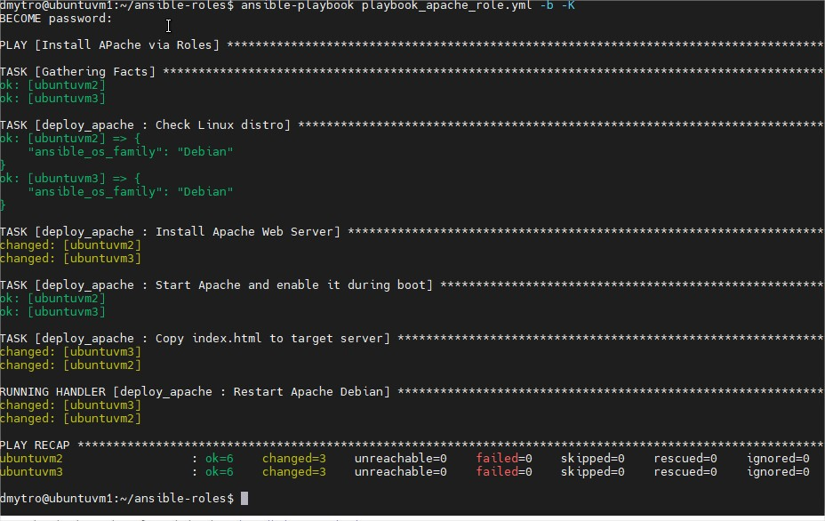

# Task 10

## Ansible Intro

## Ping playbok

## Apache playbooks

### Simple Apache install (index.html modified manualy)

###  Simple Apache install with copy index.html

###  Simple Apache install with copy index.html and restart service apache

### Simple Apache install via Ansibe roles 

