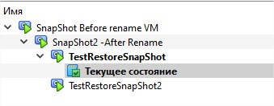
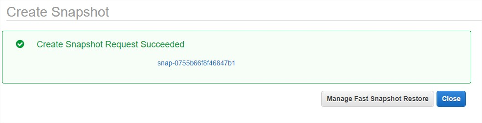
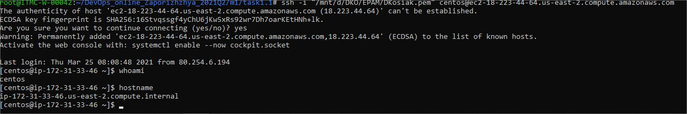
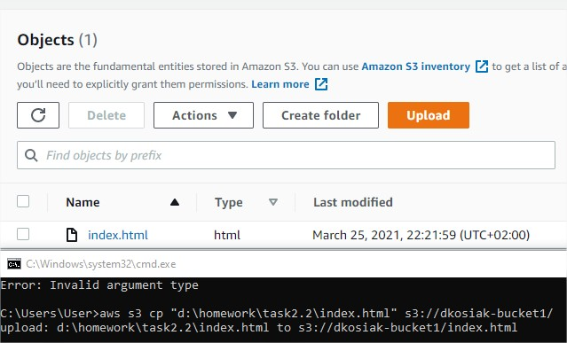

# Task 2
# Task2.1
The most popular Hypervisors for infrastrucute virtualzation are VMWARE and Hyper-V. If we want to use cloud Virtualization the best way would be use Amazon AWS or Microsoft Azure. 

## What was done in Task 2 Part 2

First of all I've downloaded and install VirtualBox and according to points of task was doing needed action.

> I've created VM's:
Create VM1_Kosiak and clone it via GUI and VBoxManage to VM2_Kosiak. 

> Create group of VM's where put VM1 and VM2 and try to start, reboot, stop togeher and independently. 

> For VM2 I've done tree of snapshots like git brunches for testing this technology.

> I've done export VM1 to *.ova file and import it in another VM.

> For testing features of VirtualBox I've attached USB and Shared Folder to excahange data between VM and host machine. 

 Task 2.1 to ne continued ... ASAP

# Task 2.2

Investigating possibilities of AWS accroding Task plan

> I've created VM on AWS using Lighstail and without it.

 
> Made Snapshot

> Prepared it for launch new instances

> Created new Volume D, attach it to first VM, made fs on it, mounted and added file.

> Launched second VM from backup.

> Reatach Volume D from VM1 to VM2 and check is it all correct.
 

> Investigating S3 instruments. Add bucket and push files to there using GUI and CLI

> Tried to deploy Docker containers on Amazon ESC.

> And made static website on Amazon S3 [EPAM DevOps  online Spring 2021]

[EPAM DevOps  online Spring 2021]http://dkosiak-bucket1.s3-website.us-east-2.amazonaws.com/
