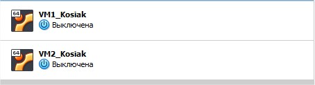
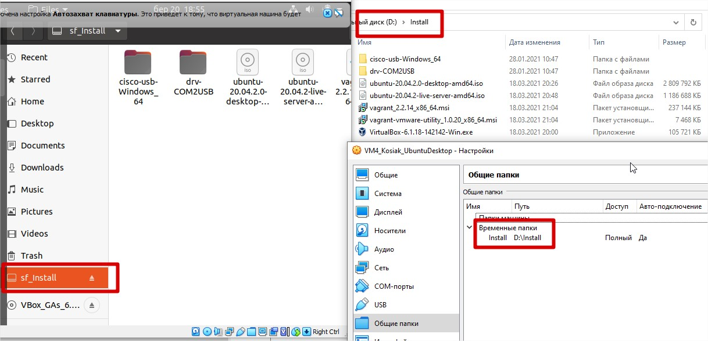

# Task2.1

First of all I've downloaded and install VirtualBox and according to points of task was doing needed action.

> I've created VM's:
Create VM1_Kosiak and clone it via GUI and VBoxManage to VM2_Kosiak. 

> Create group of VM's where put VM1 and VM2 and try to start, reboot, stop togeher and independently. 

> For VM2 I've done tree of snapshots like git brunches for testing this technology.

> I've done export VM1 to *.ova file and import it in another VM.

> For testing features of VirtualBox I've attached USB and Shared Folder to excahange data between VM and host machine. 

 Task 2.1 to ne continued ... ASAP
