# Task4

## Task 4.1 

### Part 1. Work wiht Hub

Create task's schema and check ICMP packet way through HUB

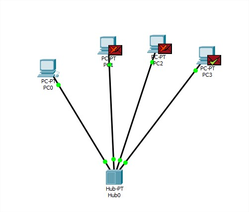

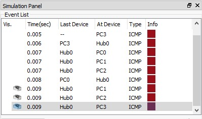

Watch same packet way through 2 HUBs

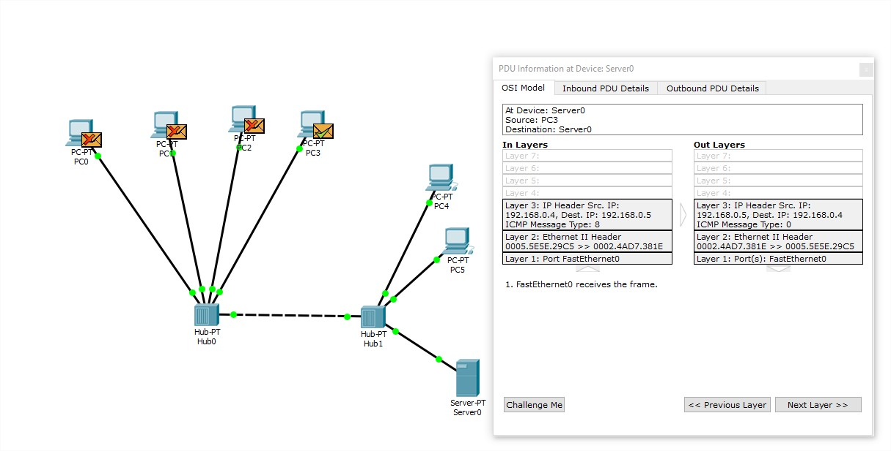

### Part 2. Work with Switch

Create task's schema and check ICMP packet way through SWITCH

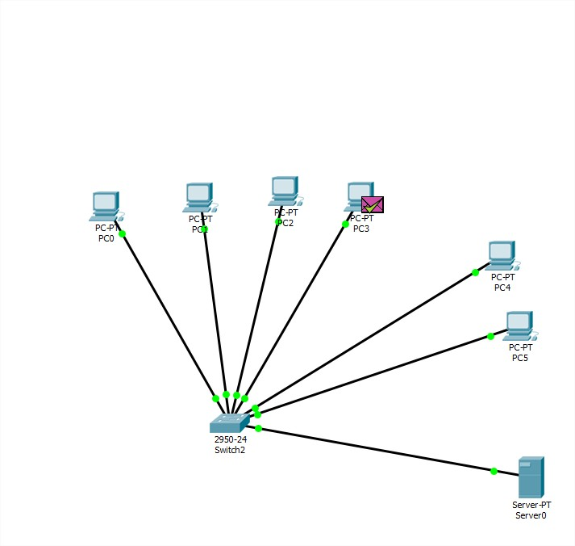

Watch same packet way through 2 SWITCHes 

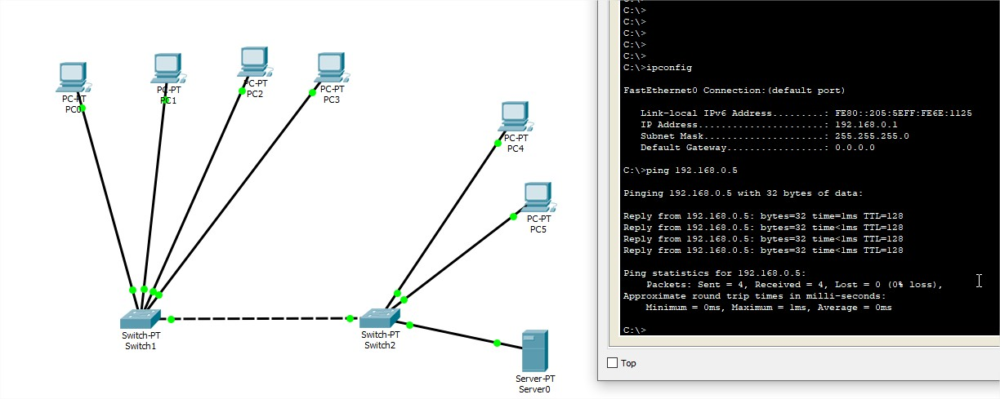

### Part 3. Work with Router

Create task's schema and check ICMP packet way through Sitches and Riuter between them 

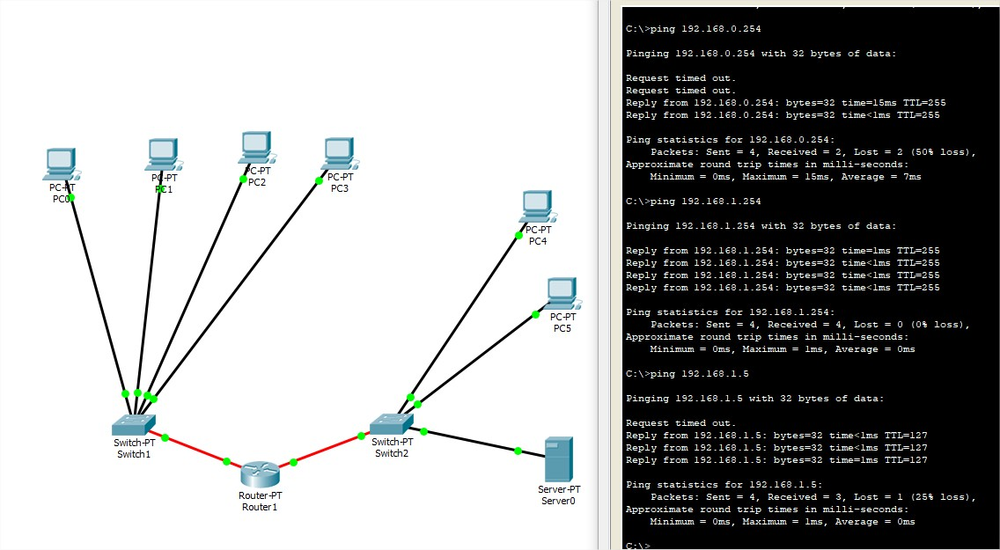

## Task 4.2

### Part 1

Network schema  for 2 buildigs with 2 floors

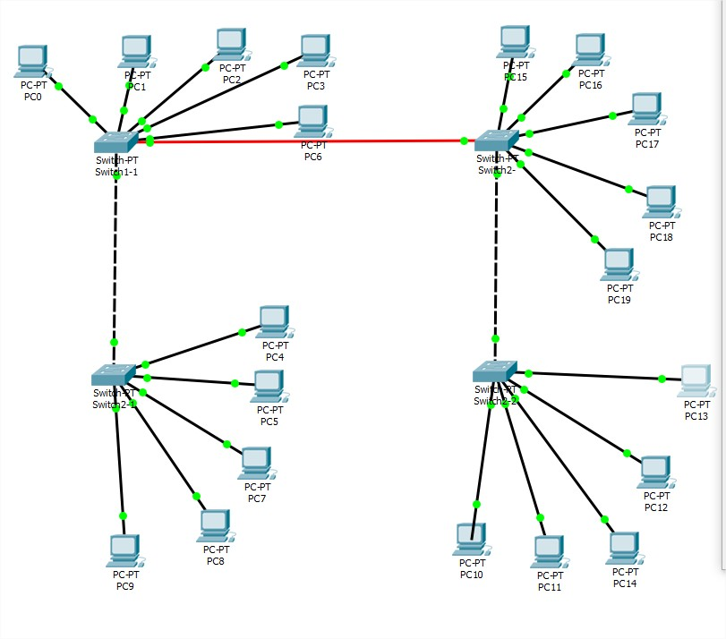

PC IPs for schema:

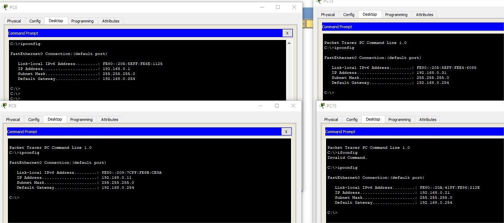

Check network availability:

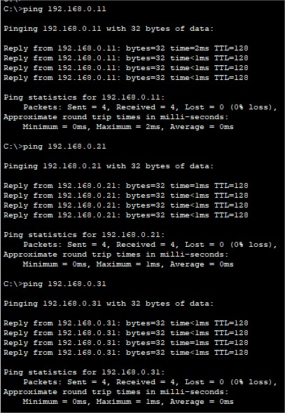

### Part 2

Network schema  for 1 buildig with 4 floors

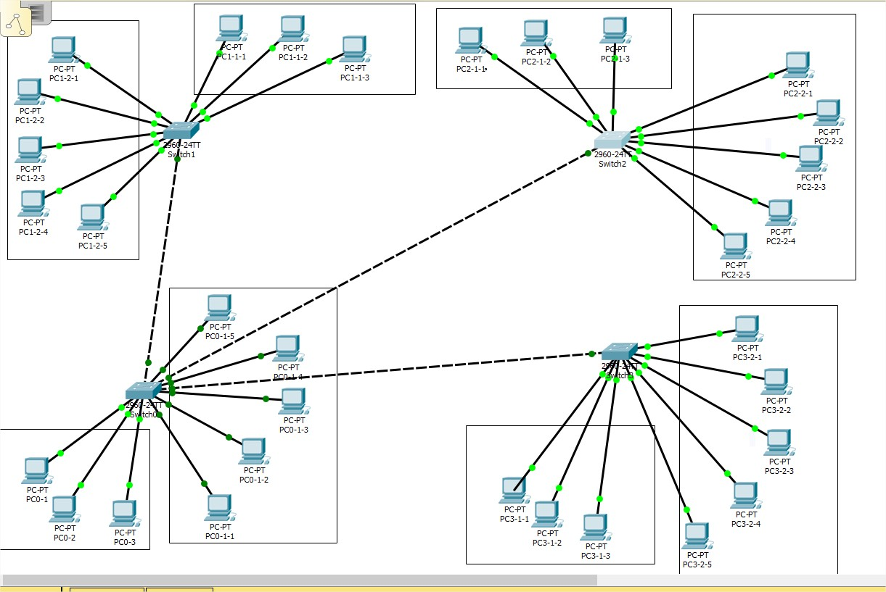

Check network availability:

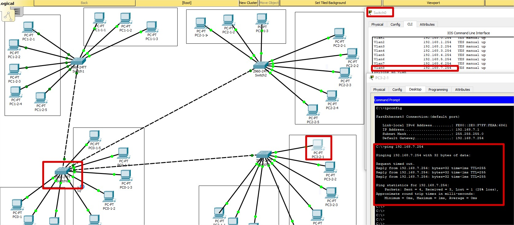

###Part 3

Network schema  for 6 buildigs with 1 floor

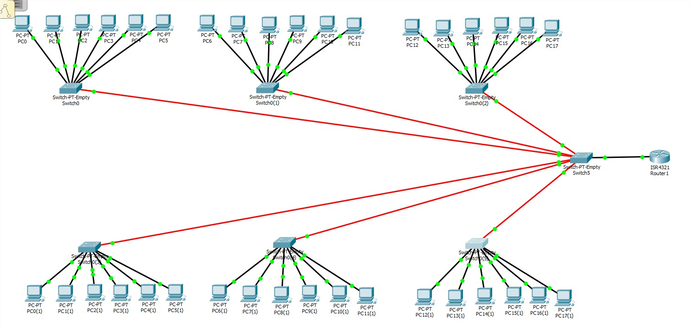

Check network availability:

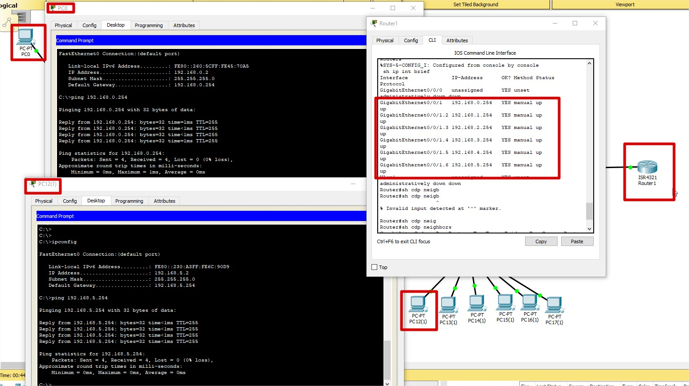

## Task 4.3

Network schema  and Check network availability:

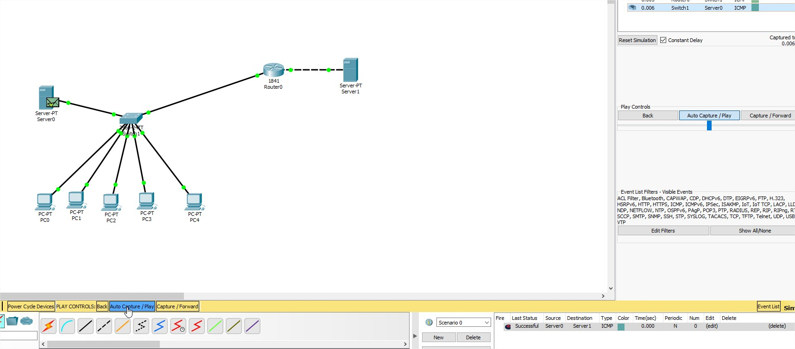

## Task 4.4

Network schema  and Check network availability:

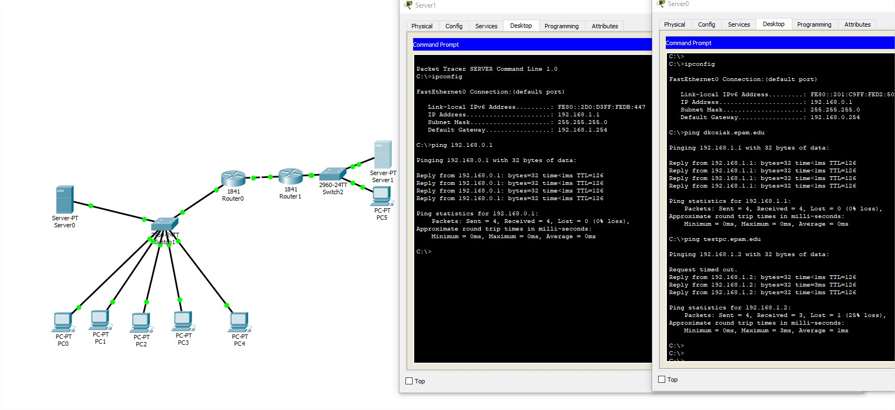

