# Task 6

## Task 6.1

> I've created VM's:

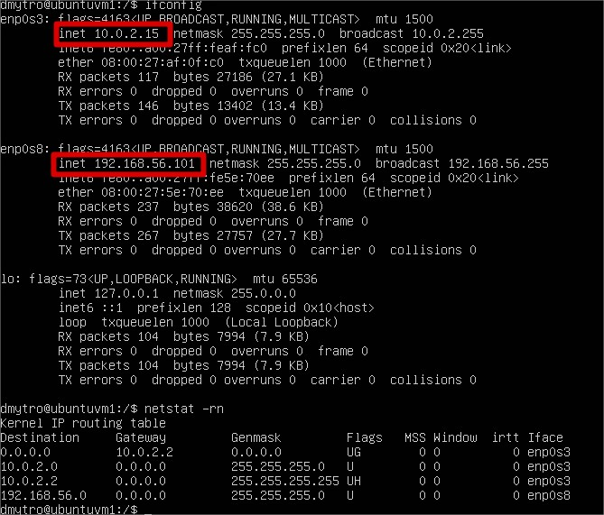

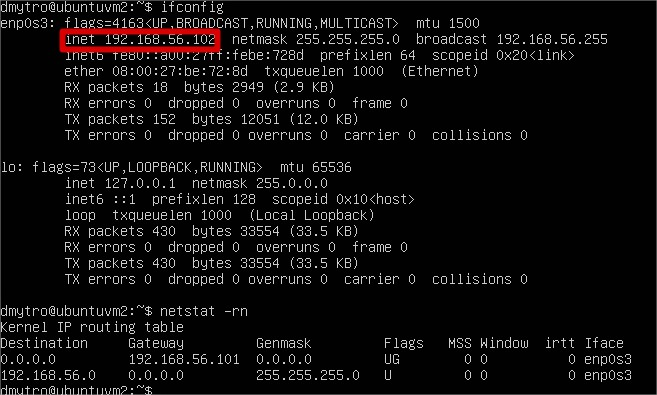

> And have checked access to Internet from VM2 via VM1

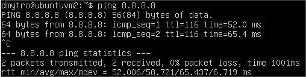

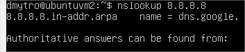

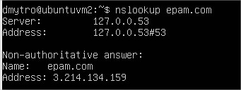

## Task 6.2

#### New scheme have been created 

> isc-dhcp-server has been configured:

ubuntuvm1:

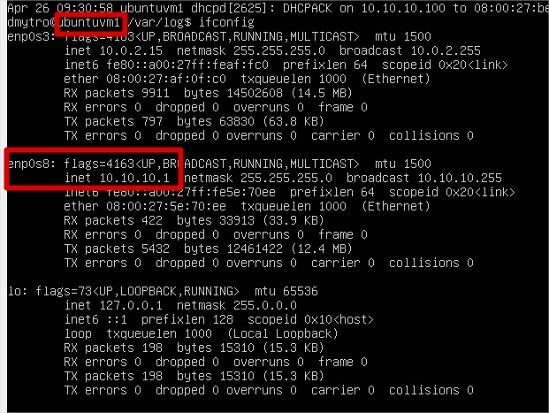

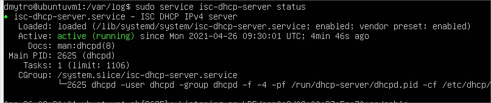

ubuntuvm2:

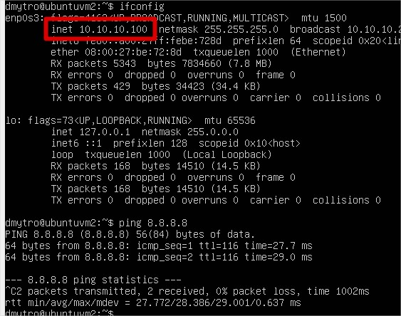

ubuntuvm3:

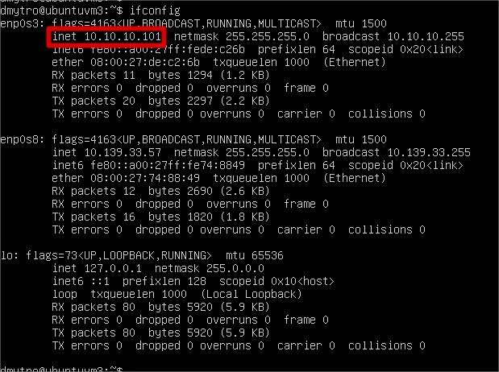
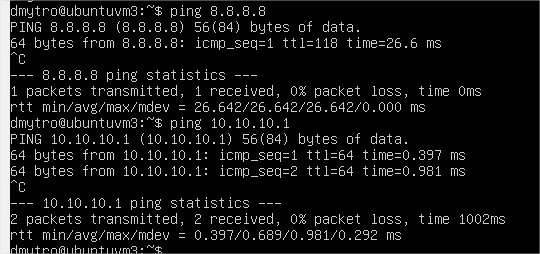

> Dnsmasq has been configured:

ubuntuvm1:

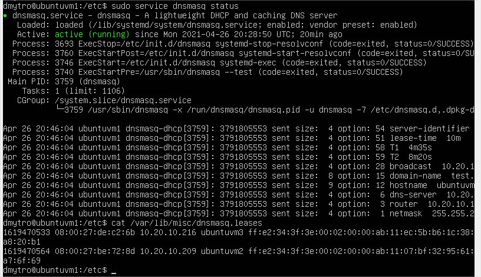

ubuntuvm2:

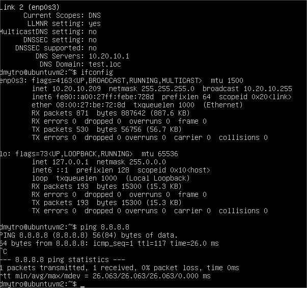

ubuntuvm3:

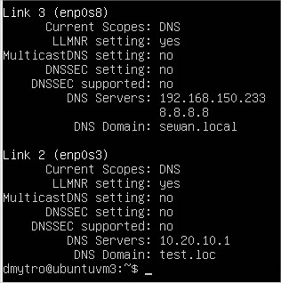

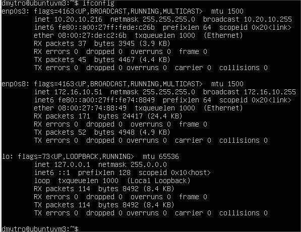

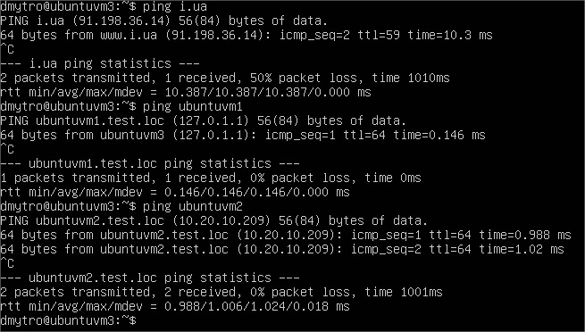