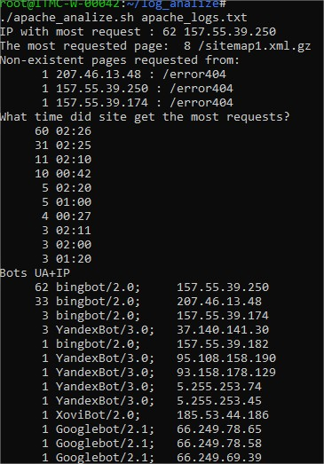

# Task 7

## Task 7.1 
I've created file script for:
- displaying the IP addresses and symbolic names of all hosts in the current subnet
- displaying a list of open system TCP ports

```sh
#!/bin/bash
all_key_var="--all"
target_key_var="--target"

function print_keys_func
{
echo "The --all key displays the IP addresses and symbolic names of all hosts in the current subnet"
echo "The --target key displays a list of open system TCP ports."
}

function all_key_func
{
nmap -sn  172.16.10.0/24
}

function target_key_func
{
netstat -tulnp | grep LISTEN
}

echo  Number of parametrs "$#"

if [ -n "$1" ]
then
echo "You are used $1."
if [ "$1" == "--all" ]
then
all_key_func
elif [ "$1" == "--target" ]
then
target_key_func
fi
else
echo "No parameters found. "
echo "You can use next:"
print_keys_func
fi
```

## Task 7.2

I've created file script for analize apache log file and use in it next commands:

> awk '{print $1}' $1 | sort | uniq -c | sort -gr 

> awk '{print $7}' $1 | sort | uniq -c | sort -gr 

> awk '{print $1 " : " $7}' $1 | grep 'error404' | sort | uniq -c | sort -gr 

> awk '{ print $4}' $1 | awk -F : '{ print $2 ":" $3}' | sort | uniq -c | sort -gr 

> awk '{ print $14 " \t " $1}' $1 | grep -i 'bot' | sort | uniq -c | sort -gr 

