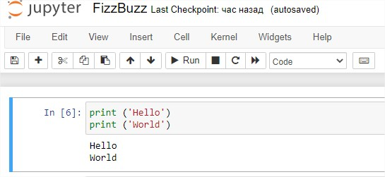
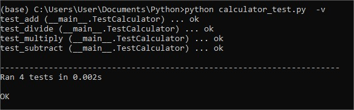

# Task 9

## First Step "Hello, world!"



## Unit test for Calculator

Calculator Example:

```sh
class Calculator:
    def add(self, a, b):
        return a+b
    def subtract(self, a, b):
        return a-b
    def multiply(self, a, b):
        return a*b
    def divide(self, a, b):
        return a/b
```

Unit Test Example:

```sh
import unittest
from calculator import Calculator

class TestCalculator(unittest.TestCase):
    
    def test_add(self):
        a=3
        b=5
        result = Calculator.add(self,a,b)
        self.assertEqual(result,8)

    def test_subtract(self):
        a=11
        b=5
        result = Calculator.subtract(self,a,b)
        self.assertEqual(result,6)

    def test_multiply(self):
        a=3
        b=5
        result = Calculator.multiply(self,a,b)
        self.assertEqual(result,15)

    def test_divide(self):
        a=20
        b=5
        result = Calculator.divide(self,a,b)
        self.assertEqual(result,4)
        
if __name__ == '__main__':
    unittest.main()
```

Result of Unit Test:

